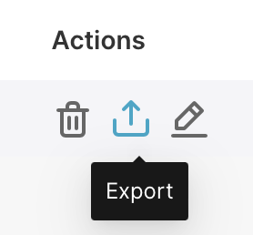
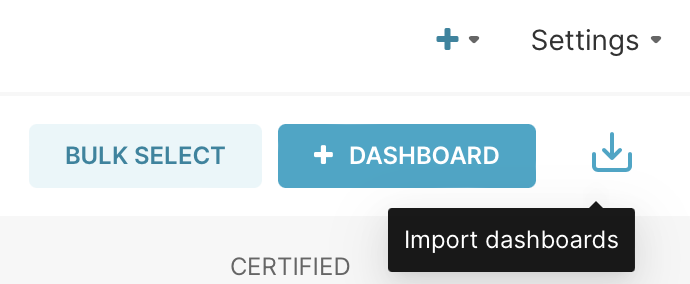
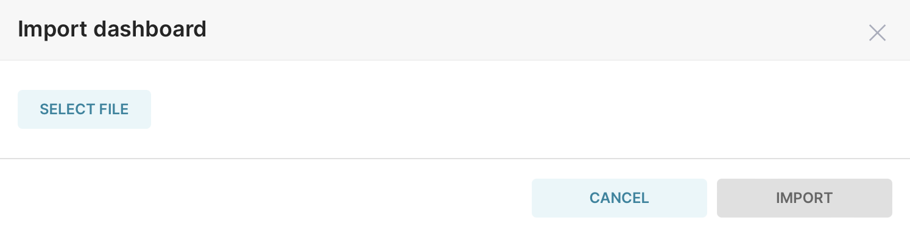
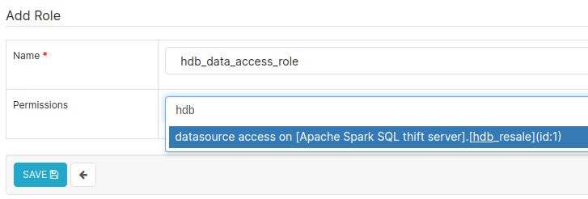
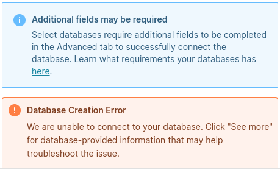

Superset in vbrani
===
### Introduction
This repository contains code to install Apache Superset through Helm, onto a Kubernetes cluster. Specifically, this implementation includes configurations that allow for Ingress to expose a http/https route with a domain name, and OAuth authentication.

### Stack
The components of this implementation are as follows:
1. Google Cloud Platform (GCP): Google's broad suite of cloud computing services.
2. Kubernetes (K8s): K8s is an open-source system for automating deployment, scaling, and management of containerised applications. K8s is can be deployed standalone, or provisioned through a 3rd party cloud service provider such as Google Kubernetes Engine (GKE).
3. Helm: A package manager for K8s, where each package is referred to as a "chart". Charts are an abstracted collection of .yaml K8s config files which would otherwise have to be manually created and maintained for every installation of a containerised application.
4. Apache Superset: An open-source visualisation tool and SQL IDE that is built atop Flask. It is a robust tool with a large variety of visualisations and connections to different databases.

### Usage Instructions
The best practice for configuration is for the key-value pairs within `<chart dir>/template/<filename>.yaml` config files to dynamically reference a `values.yaml` file using the Go templating engine under the hood. This section discusses configuring the release of the Superset Helm chart to use Ingress and OAuth.
#### 1. Ingress Configuration 
The `<chart dir>/template/ingress.yaml` config file already has the necessary key-value pairs to utilise the Go templating engine for dynamic referencing. What needs to be done is to input your `hostname` into this segment of the `my-values.yaml` file.
```
ingress:
  enabled: true
  annotations:
    acme.cert-manager.io/http01-edit-in-place: "true"
    cert-manager.io/cluster-issuer: letsencrypt-prod
    cert-manager.io/issue-temporary-certificate: "true"
    kubernetes.io/ingress.class: nginx
    meta.helm.sh/release-name: superset
  path: /
  pathType: Prefix
  hosts:
     - # <insert hostname>
  tls:
  - hosts:
      - # <insert hostname>
  #  - secretName: chart-example-tls
  #    hosts:
  #      - chart-example.local
```
```
helm upgrade superset superset/superset --install --values my_values.yaml --namespace <insert namespace>
```


#### 2. Deploy Superset with Ingress and OAUTH


#### 3. Connect to database
The current deployment is connected to an Apache Spark SQL database server.

To connect to other databases, please refer to the [official Apache Superset docs](https://superset.apache.org/docs/databases/installing-database-drivers) to check for PyPI dependencies and connection string format.

#### 4. Export Superset Dashboard, Chart and Dataset
Go to the Dashboards list page, from the "Actions" columns of to-be-exported dashboard, click "Export" button. The Dashboards, its Charts and its Datasets will be exported together.



#### 5. Import Superset Dashboard, Chart and Dataset
5.1 Go to the Dashboards list page, from the right top cornor, click "Import Dashboards" button. The Dashboards, its Charts and its Datasets will be imported together.



5.2 
Choose the file that going to be imported and click "IMPORT" button. The dashboards will be imported after that.



#### 6. Role-Based Access Management
Roles can be configured in ```Settings > List Roles > +```.

Superset comes with several predefined roles as described in the [official documentation](https://superset.apache.org/docs/security/).

The "Gamma" role can be used as a basic template for new roles. Thereafter, datasource accesses can be granted to roles to restrict access to specific datasets, which in turn restricts what users with that role can view in dashboards.


#### 7. Uninstall Superset with Helm
```
helm uninstall superset --namespace batch11-dataops-playground
```

### Known Issues
* Database connection error message:



